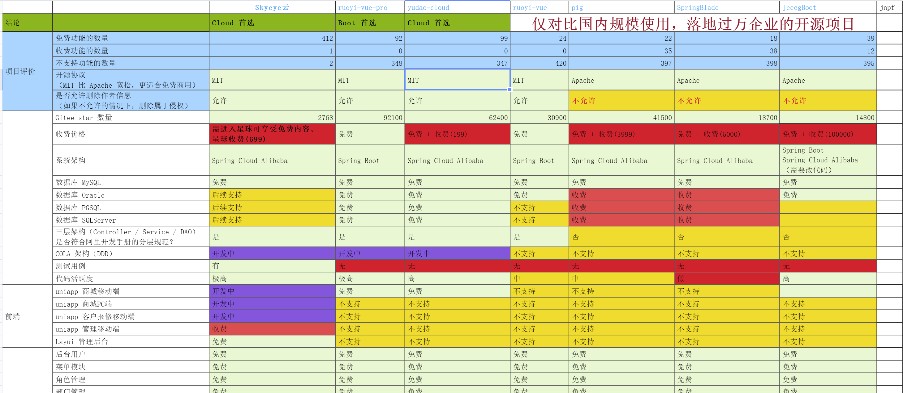

#  :tw-1f308:  skyeye

> 智能制造一体化，采用Springboot + winUI的低代码平台开发模式。包含30多个应用模块、50多种电子流程，CRM、PM、ERP、MES、ADM、EHR、笔记、知识库、项目、门店、商城、财务、多班次考勤、薪资、招聘、云售后、论坛、公告、问卷、报表设计、工作流、日程、云盘等全面管理，实现智能制造行业一体化管理。实现管理流程“客户关系->
线上/线下报价->销售报价->销售合同->生产计划->商品设计->采购->加工制造->入库->发货->售后服务”的高效运作，同时实现企业员工的管理以及内部运作的流程操作，完善了员工从“入职->培训->转正->办公->离职”等多项功能。

**郑重声明：** 

**1. Skyeye云【源代码】针对 {星球用户} 开源。拿到源码后可进行学习、毕设、企业等使用。**

**2. [开发文档](https://articles.zsxq.com/id_xi3xhacte72g.html)**

**3. [常见问题](https://gitee.com/dromara/skyeye/blob/company_server/%E5%B8%B8%E8%A7%81%E9%97%AE%E9%A2%98.md)，优先看这个。《《《《《《《《《《《《《《这个文件必看，有`移动端`的详细说明。**

**4. **体验地址** ：右上角`Star`后，关注下方微信公众号，回复`skyeye`获取**

**5. 同时，星球内富含Java、消息队列、数据库、缓存、Spring等后端以及Vue、React等前端的高频面试题，并有人会讲解每个知识点的实战使用。**

**为什么推荐使用本项目？**

① 个人与企业可 100% 免费使用，不用保留类作者、Copyright 信息。

② 代码全部开放，让你可以了解整个项目的架构设计。

③ 具备低代码、功能全面、快速便捷开发、无需重复的CRUD等优点，短时间内可完成一款系统的开发。

④ [国产开源项目对比](https://docs.qq.com/sheet/DYUtPdWhTbVBITlpL?tab=000001)。

本项目的GitCode地址: https://gitcode.com/doc_wei/skyeye-oa

## 🐶 沟通交流

| |   知识星球   | 微信公众号(Skyeye智能制造云办公) | QQ交流群 |
|:---------------------:|:-------------------:|:-------------------:|:------------:|
| 微信扫码 |  |    |  |

* **操作视频**

  * 综合

    * [Skyeye 操作视频（个人中心-行政-ERP-CRM） 2024-02-25](https://www.bilibili.com/video/BV1rz421X7eM/?vd_source=714dd9434dc2ba981f2f47b7aa44be38)
    * [行政+ERP手机端 2024-01-28](https://www.bilibili.com/video/BV1ke411E7d6/?vd_source=714dd9434dc2ba981f2f47b7aa44be38)
  * 基础模块

    * [Skyeye系列 团队模板,编码管理,业务对象管理 2023-03-26](https://www.bilibili.com/video/BV17h411V7gn/?vd_source=714dd9434dc2ba981f2f47b7aa44be38)
    * [Skyeye系列-菜单角色赋权 2023-03-21](https://www.bilibili.com/video/BV1mm4y1r7Qn/?vd_source=714dd9434dc2ba981f2f47b7aa44be38)
    * [我的日程 2019-03-10](https://www.bilibili.com/video/BV1vb411i75M/)
    * [Skyeye项目-聊天功能 2019-02-15](https://www.bilibili.com/video/BV11b41127FV/?vd_source=714dd9434dc2ba981f2f47b7aa44be38)
    * [Skyeye项目-多桌面任务 2019-02-15](https://www.bilibili.com/video/BV1yb41127oB/?vd_source=714dd9434dc2ba981f2f47b7aa44be38)
  * 工作流

    * [Skyeye系列-工作流 2023-04-08](https://www.bilibili.com/video/BV17k4y1v7vR/?vd_source=714dd9434dc2ba981f2f47b7aa44be38)
  * CRM

    * [Skyeye系列-CRM 2023-03-28](https://www.bilibili.com/video/BV1Sk4y1471x/?vd_source=714dd9434dc2ba981f2f47b7aa44be38)
  * ERP

    * [Skyeye系列-erp+生产模块 2020-07-13](https://www.bilibili.com/video/BV1yA411e7mm/)

## 项目框架介绍

### 环境依赖

| 依赖 | 版本 | 端口 |
|:---------------------:|:---------------------:|:---------------------:|
| Java | 1.8 | 无 |
| rocket MQ | 4.9.2 | 9876 |
| Redis | 5.0 / 6.0 | 6379 |
| nacos | 2.3.0 | 8848|
| MySQL | 5.7或更高版本，[点我配置](https://blog.csdn.net/qq_42175986/article/details/82384160) | 3308 |

### 微服务项目

> 介绍整体微服务的目录结构以及端口的占用情况。

| 工程 | 端口 | 介绍 | jar包名称 |
|:---------------------:|:---------------------:|:---------------------:|:---------------------:|
| - | - | 后台微服务公共配置项 |
|skyeye-web |8080 | **前端工程**  |web.jar |
|skyeye-promote |8081 | **基础工程** (包含用户、组织、权限、API、消息队列、Skyeye系列的服务注册等基础服务)， **优先启动该工程** 。 |skyeye-web.jar |
|skyeye-shop |8082 |商城 |shop-web.jar |
|skyeye-flowable |8083 |工作流 |flowable-web.jar |
|skyeye-report |8085 |报表设计器 |report-web.jar |
|xxl-job-2.3.0 |8200 |定时任务 |xxl-job-admin-2.3.0.jar |
|skyeye-school |8084 |学校模块 |school-web.jar |
|skyeye-wages |8101 |薪资模块 |wages-web.jar |
|skyeye-deploy |8010 |部署模块 |deploy-web.war |
|skyeye-adm |8103 |行政模块 |adm-web.jar |
|skyeye-boss |8104 |招聘模块 |boss-web.jar |
|skyeye-checkwork |8105 |考勤模块 |checkwork-web.jar |
|skyeye-crm |8102 |客户管理模块 |crm-web.jar |
|skyeye-ifs |8107 |财务模块 |ifs-web.jar |
|skyeye-project |8109 |PM项目管理模块 |project-web.jar |
|skyeye-erp |8106 |ERP+生产模块+仓库 |erp-web.jar |
|skyeye-seal-service |8108 |售后服务模块 |seal-service-web.jar |

## 系统功能结构图

> 功能结构图内容较多，加载可能会有点慢，请耐心等待。

##  :tw-1f31e:  架构介绍

###  :jack_o_lantern:  技术选型

#### 后端技术:

| 框架 | 说明 | 版本 | 学习指南 |
|---|---|---|---|
| [Spring Cloud Alibaba](https://github.com/alibaba/spring-cloud-alibaba)    | 微服务框架  | 2.1.0.RELEASE  | [文档](https://github.com/YunaiV/SpringBoot-Labs) |
| [Nacos](https://nacos.io/)   | 配置中心 & 注册中心  | 1.4.3  | [文档](https://nacos.io/docs/v1/what-is-nacos/)   |
| [RocketMQ](https://rocketmq.apache.org/zh/)  | 消息队列 | 4.0.0 | [文档](https://rocketmq.apache.org/zh/docs/4.x/)             |
| [Sentinel](https://github.com/alibaba/sentinel)  | 服务保障| 2.1.0.RELEASE  | [文档](https://zhuanlan.zhihu.com/p/681044230)             |
| [XXL Job](https://github.com/xuxueli/xxl-job) | 定时任务 | 2.3.0 | [文档](https://www.xuxueli.com/xxl-job/#google_vignette) |
| [Spring Cloud Zuul](https://cloud.spring.io/spring-cloud-netflix/multi/multi__router_and_filter_zuul.html)                | 服务网关             | 3.4.1       | [文档](https://www.jianshu.com/p/cf748031a08d) |
| [MySQL](https://www.mysql.com/cn/)                                                          | 数据库服务器           | 5.7 / 8.0+  |                                                                     |
| [Druid](https://github.com/alibaba/druid)                                                   | JDBC 连接池、监控组件    | 1.2.23      | [文档](https://zhuanlan.zhihu.com/p/555116830)      |
| [MyBatis Plus](https://baomidou.com/)                                                    | MyBatis 增强工具包    | 3.5.7       | [文档](https://baomidou.com/introduce/)              |
| [Redis](https://redis.io/)                                                                  | key-value 数据库    | 5.0 / 6.0   |                                                                     |
| [Flowable](https://github.com/flowable/flowable-engine)                                     | 工作流引擎            | 6.8.0       | [文档](https://doc.iocoder.cn/bpm/)                                   |
| [Spring Boot Admin](https://github.com/codecentric/spring-boot-admin)                       | Spring Boot 监控平台 | 2.0.3      | [文档](https://blog.51cto.com/u_15916106/7063036)                |
| [hutool](https://www.hutool.cn/)                                                         | 一个小而全的Java工具类库    | 5.5.4 | [文档](https://doc.hutool.cn/pages/index/)            |
| [Lombok](https://projectlombok.org/)                                                        | 消除冗长的 Java 代码    | 1.16.22     | [文档](https://zhuanlan.zhihu.com/p/32779910)               |
| [JUnit](https://junit.org/junit5/)                                                          | Java 单元测试框架      | 4.12       | -                                                                   |

#### 前端技术：

| 框架 | 技术 | 版本 | 学习指南 |
|---|---|---|---|
|[layui](https://layui.uimaker.com/)|模块化前端UI，已经开发完成| 2.6.7 | [文档](https://layui.uimaker.com/doc/index.html) |
|Vue 3 + TypeScript 5 + Vite 5 + Ant Design Vue 4| **开发中** | - | - |
|winui|win10风格UI|自研|-|
|[uni-app](https://uniapp.dcloud.net.cn/)|一个使用Vue.js开发所有前端应用的框架，开发者编写一套代码，可发布到iOS、Android、Web（响应式）、以及各种小程序、快应用等多个平台。| VUE3 |[文档](https://uniapp.dcloud.net.cn/component/)|

##  :tw-1f30f:  PC端效果图

### 基础内容
|功能| 效果图 | 效果图 | 效果图 |
|----|-------|-----|------|
|组件管理||||
|布局/操作/属性管理||||
|菜单/角色/编码管理||||

### CRM
|功能| 效果图 | 效果图 | 效果图 |
|----|-------|-----|------|
|客户管理(包括合同、跟单、文档等)||||
|客户管理(包括合同、跟单、文档等)||||
|报表分析||||

### ERP
|功能| 效果图 | 效果图 | 效果图 |
|----|-------|-----|------|
|商品管理 **(支持一物一码)** ||||
|采购模块||||
|采购模块||||
|销售模块||||
|报表模块||||

### ERP仓库
|功能| 效果图 | 效果图 | 效果图 |
|----|-------|-----|------|
|其他单据管理||||
|仓库管理||||
|盘点管理||||
|出入库管理||||
|商品条形码||||

### MES生产
|功能| 效果图 | 效果图 | 效果图 |
|----|-------|-----|------|
|生产管理||||
|设置中心||||
|物料管理||||
|生产执行||||
|物料确认||||

### 行政办公
|功能| 效果图 | 效果图 | 效果图 |
|----|-------|-----|------|
|会议室模块||||
|用品模块||||
|资产模块||||
|公文模块||||
|印章，证照，车辆||||

### 售后管理模块
|功能| 效果图 | 效果图 | 效果图 |
|----|-------|-----|------|
|工单管理||||
|配件管理||||
|工人管理||||

##  :tw-1f30f:  移动端效果图

> 移动端和PC端功能类似，这里不截那么多图拉。

### 基础模块
| 效果图  | 效果图  | 效果图  | 效果图  |
|--------|-------|-------|-------|
|||||

### ERP

| 效果图  | 效果图  | 效果图  | 效果图  |
|--------|-------|-------|-------|
|||||

### CRM

| 效果图  | 效果图  | 效果图  | 效果图  |
|--------|-------|-------|-------|
|||||

### OA

| 效果图  | 效果图  | 效果图  | 效果图  |
|--------|-------|-------|-------|
|||||

## 特别赞助

> 点击图片即可跳转

|  赞助商  |  赞助商  |  赞助商  |  赞助商  |
|--------|-------|-------|-------|
|  |  |||
